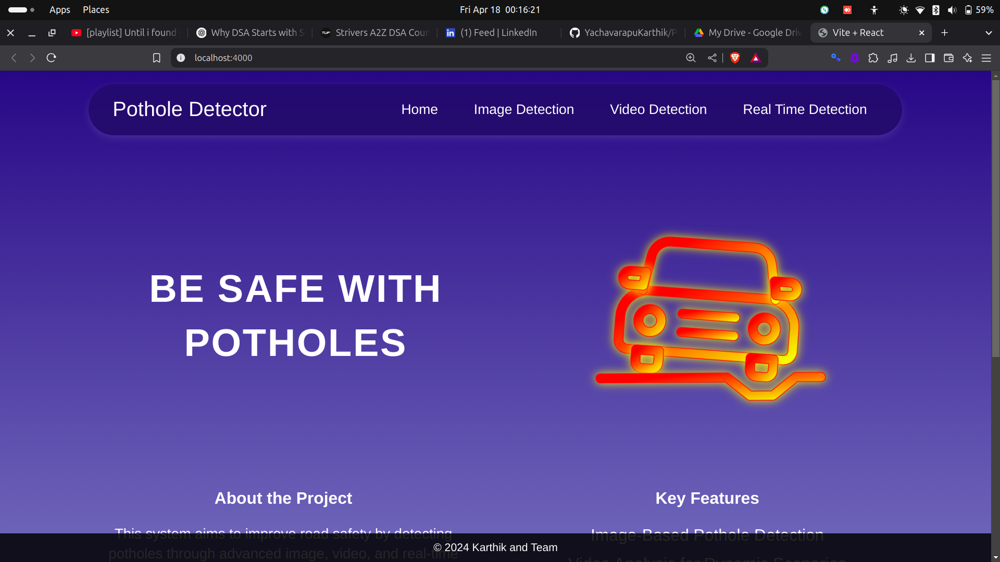
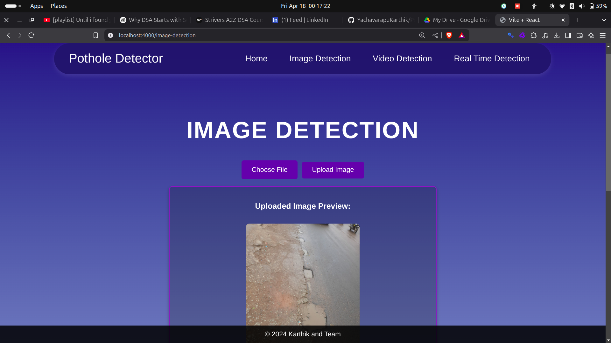
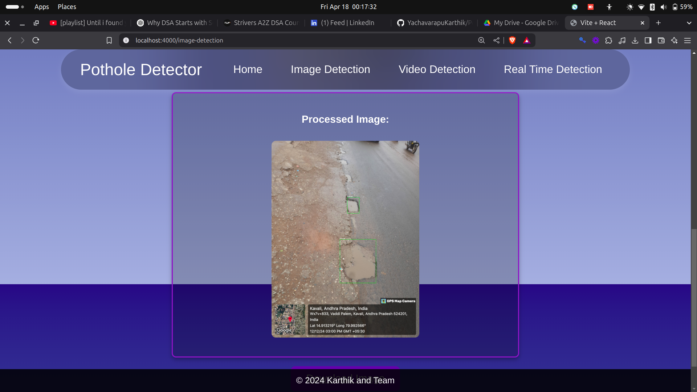

# Pothole Detection System 

A real-time pothole detection system leveraging deep learning and computer vision, designed with a modern frontend-backend architecture. The system helps in identifying potholes from video streams or images, assisting in improving road safety and infrastructure maintenance.

---

## 📚 Project Description

This project implements an automated pothole detection solution:
- A **YOLOv8 deep learning model** trained using **Darknet** architecture for high-accuracy detection.
- A **React + Vite** frontend for a responsive user interface.
- A **Python Flask** backend serving as an API layer between the model and the frontend.
  
Users can upload images or videos, view real-time detection results, and analyze pothole data in a clean, intuitive interface.

---

## 🧠 Tech Stack

| Layer | Technology |
|------|-------------|
| Frontend | React + Vite |
| Backend | Python Flask |
| Model | YOLOv8 (trained using Darknet) |
| Supporting Libraries | OpenCV, Flask-RESTful, PyTorch |

---

## ⚙️ Features

- ✅ Real-time pothole detection from uploaded videos/images
- ✅ Lightweight frontend built with React and Vite
- ✅ Flask-based API integration for backend inference
- ✅ YOLOv8 model fine-tuned on pothole datasets using Darknet
- ✅ Responsive design with clean UI/UX
- ✅ Organized folder structure and scalable codebase

---

## 🖼️ Screenshots

---
### Looking to collab with this realtime project with an vehicle . Contact me about know more about this project
## mail : karthikyacharapu@gmail.com
